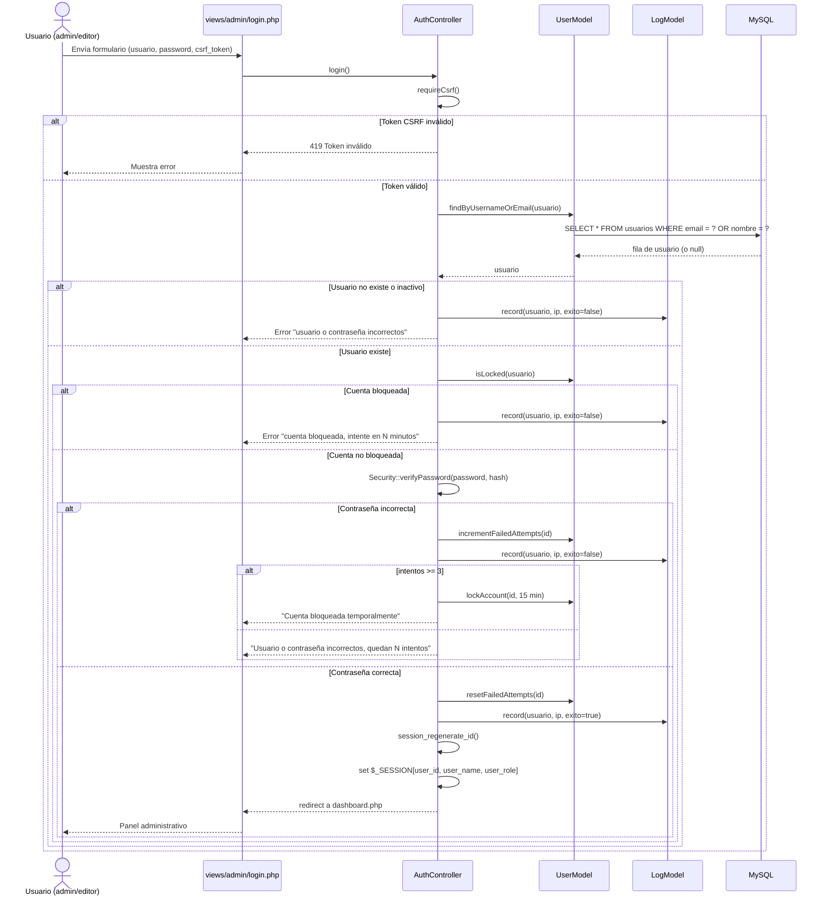
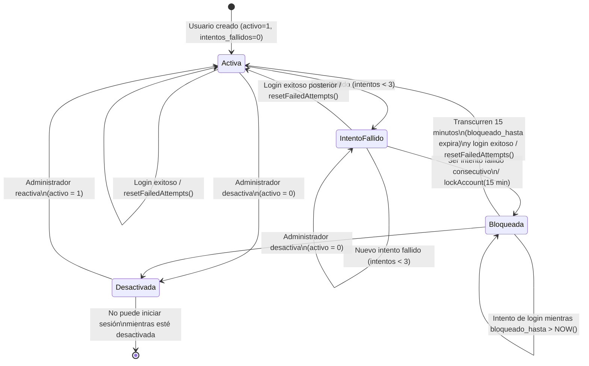
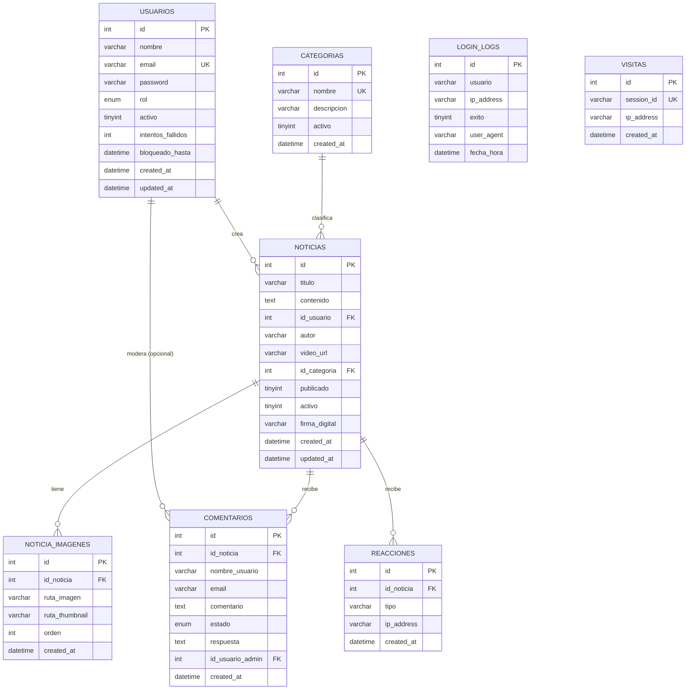

# Diagramas UML — Sistema de Noticias

Los diagramas se presentan en formato **Mermaid** (texto), visualizable directamente en GitHub, VS Code (extensión Mermaid), o en [mermaid.live](https://mermaid.live).

---

## 1. Diagrama de casos de uso

```mermaid
flowchart LR
    Admin((Administrador))
    Supervisor((Supervisor))
    Editor((Editor))
    Visitante((Visitante público))

    subgraph "Módulo administrativo"
        UC1[Iniciar sesión]
        UC2[Gestionar usuarios]
        UC3[Gestionar categorías]
        UC4[Crear / modificar noticias propias]
        UC4b[Publicar cualquier noticia]
        UC5[Subir imágenes y video de noticia]
        UC6[Aprobar / bloquear / eliminar comentarios]
        UC6b[Responder comentarios]
        UC7[Ver estadísticas por período]
        UC8[Cerrar sesión]
    end

    subgraph "Módulo público"
        UC9[Ver portada]
        UC10[Ver listado de noticias]
        UC11[Filtrar / buscar noticias]
        UC12[Ver detalle de noticia]
        UC13[Comentar noticia]
        UC14[Reaccionar con icono]
        UC15[Ver página "Nosotros"]
    end

    Admin --> UC1
    Admin --> UC2
    Admin --> UC3
    Admin --> UC4
    Admin --> UC4b
    Admin --> UC6
    Admin --> UC6b
    Admin --> UC7
    Admin --> UC8
    UC4 --> UC5

    Supervisor --> UC1
    Supervisor --> UC3
    Supervisor --> UC4
    Supervisor --> UC4b
    Supervisor --> UC6
    Supervisor --> UC7
    Supervisor --> UC8

    Editor --> UC1
    Editor --> UC4
    Editor --> UC7
    Editor --> UC8
    UC4 --> UC5

    Visitante --> UC9
    Visitante --> UC10
    UC10 --> UC11
    Visitante --> UC12
    UC12 --> UC13
    UC12 --> UC14
    Visitante --> UC15
```

**Notas:**
- `Editor` no tiene acceso a "Gestionar usuarios", "Gestionar categorías", "Publicar cualquier noticia" ni a la moderación de comentarios (restringidos mediante `BaseController::requireRole()`, `NewsController::isPrivileged()`/`canModify()` y `CommentController::requireModerator()`).
- Solo `Admin` puede responder comentarios (`CommentController::reply()`); `Supervisor` puede aprobar/bloquear/eliminar pero no responder.
- Los casos de uso del visitante no requieren autenticación.

---

## 2. Diagrama de clases

```mermaid
classDiagram
    class CrudInterface {
        <<interface>>
        +all(conditions, limit, offset) array
        +find(id) array
        +create(data) int
        +update(id, data) bool
        +delete(id) bool
    }

    class ErrorHandlerInterface {
        <<interface>>
        +handleException(e)
        +handleError(level, message, file, line)
        +logMessage(level, message)
    }

    class Database {
        -static Database instance
        -PDO connection
        +getInstance() Database
        +getConnection() PDO
        +run(sql, params) PDOStatement
    }

    class Validator {
        -array errors
        +sanitizeString(value) string
        +sanitizeEmail(value) string
        +isRequired(value, field, label) self
        +isEmail(value, field, label) self
        +isValidPassword(value) self
        +fails() bool
        +getErrors() array
    }

    class HashServiceInterface {
        <<interface>>
        +hash(data) string
        +verify(data, hash) bool
    }

    class PasswordHashService {
        +hash(data) string
        +verify(data, hash) bool
    }
    HashServiceInterface <|.. PasswordHashService

    class SignatureHashService {
        +hash(data) string
        +verify(data, hash) bool
    }
    HashServiceInterface <|.. SignatureHashService

    class Security {
        +generateCsrfToken() string
        +validateCsrfToken(token) bool
        +hashPassword(plain) string
        +verifyPassword(plain, hash) bool
        +generateSignature(fields) string
        +verifySignature(fields, signature) bool
    }
    Security --> PasswordHashService
    Security --> SignatureHashService

    class ErrorHandler {
        +register()
        +handleException(e)
        +handleError(level, message, file, line) bool
        +logMessage(level, message)
    }
    ErrorHandlerInterface <|.. ErrorHandler

    class BaseModel {
        <<abstract>>
        #PDO db
        #string table
        +all(...) array
        +find(id) array
        +create(data) int
        +update(id, data) bool
        +delete(id) bool
        +count(conditions) int
    }
    CrudInterface <|.. BaseModel

    class BaseController {
        <<abstract>>
        #requireAuth()
        #requireRole(roles)
        #requireCsrf()
        #redirect(url)
        #setFlash(type, message)
    }

    class UserModel {
        +findByEmail(email) array
        +findByUsernameOrEmail(id) array
        +search(term, limit, offset) array
        +incrementFailedAttempts(id)
        +lockAccount(id, minutes)
        +isLocked(user) bool
    }
    BaseModel <|-- UserModel

    class CategoryModel {
        +allActive() array
        +nameExists(nombre, excludeId) bool
        +hasNews(id) bool
    }
    BaseModel <|-- CategoryModel

    class NewsModel {
        +findWithDetails(id) array
        +filterAdmin(filters, limit, offset) array
        +publicList(filters, limit, offset) array
        +latestPublished(count) array
        +toggleActive(id, active) bool
        +togglePublished(id, published) bool
    }
    BaseModel <|-- NewsModel

    class NewsImageModel {
        +byNews(newsId) array
        +firstThumbnail(newsId) string
    }
    BaseModel <|-- NewsImageModel

    class CommentModel {
        +byNews(newsId, status) array
        +filter(filters, limit, offset) array
        +updateStatus(id, status) bool
        +reply(id, respuesta, adminId) bool
    }
    BaseModel <|-- CommentModel

    class ReactionModel {
        +addReaction(newsId, ip, tipo) bool
        +alreadyReacted(newsId, ip) bool
        +countByNews(newsId) int
        +countByNewsGroupedByType(newsId) array
        +statsByNews() array
    }
    BaseModel <|-- ReactionModel

    class LogModel {
        +record(usuario, ip, exito, ua) int
        +recent(limit) array
    }
    BaseModel <|-- LogModel

    class VisitModel {
        +registerIfNew(sessionId, ip)
        +totalVisits() int
    }
    BaseModel <|-- VisitModel

    class ImageUploader {
        +processMultiple(filesInput) array
        +processSingle(file) array
        -createThumbnail(src, dest, mime) bool
    }

    class AuthController {
        +login() array
        +logout()
    }
    BaseController <|-- AuthController
    AuthController --> UserModel
    AuthController --> LogModel

    class UserController {
        +listPaginated(term, page) array
        +save(id) array
        +toggleActive(id)
    }
    BaseController <|-- UserController
    UserController --> UserModel

    class CategoryController {
        +listAll() array
        +save(id) array
        +delete(id) bool
    }
    BaseController <|-- CategoryController
    CategoryController --> CategoryModel

    class NewsController {
        +listPaginated(filters, page) array
        +save(id) array
        +toggleActive(id)
        +togglePublished(id)
        +deleteNews(id)
        +verifyIntegrity(news) bool
        +isPrivileged() bool
        +canModify(news) bool
    }
    BaseController <|-- NewsController
    NewsController --> NewsModel
    NewsController --> NewsImageModel
    NewsController --> ImageUploader
    NewsController --> Security

    class CommentController {
        +listPaginated(filters, page) array
        +storePublic(newsId) array
        +approve(id)
        +block(id)
        +reply(id, respuesta)
        -requireModerator()
    }
    BaseController <|-- CommentController
    CommentController --> CommentModel

    class ReactionController {
        +react(newsId, tipo) array
        +countByNewsGroupedByType(newsId) array
        +stats() array
    }
    BaseController <|-- ReactionController
    ReactionController --> ReactionModel

    class PublicController {
        +homeHighlights() array
        +listPaginated(filters, page) array
        +detail(id) array
        +registerVisit()
    }
    BaseController <|-- PublicController
    PublicController --> NewsModel
    PublicController --> VisitModel

    BaseModel --> Database
    BaseController --> Security
```



---

## 3. Diagrama de secuencia (inicio de sesión)



---

## 4. Diagrama de estados (cuenta de usuario)



---

## 5. Diagrama entidad-relación (DER)



> `LOGIN_LOGS` y `VISITAS` no tienen relación de llave foránea directa (se registran por texto libre de usuario/IP para preservar el historial aun si el usuario es eliminado).
