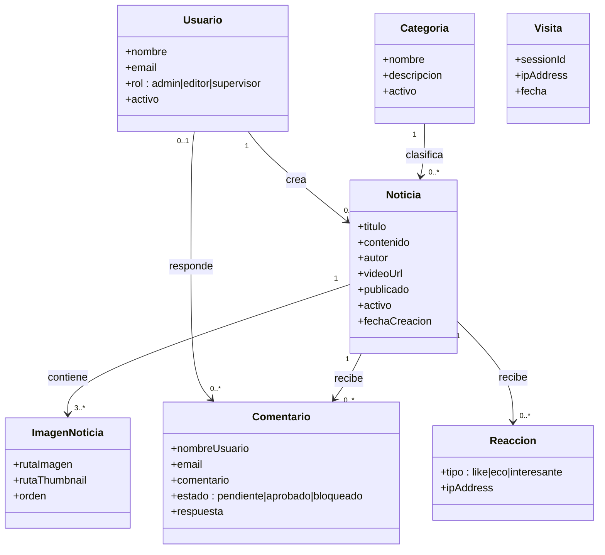
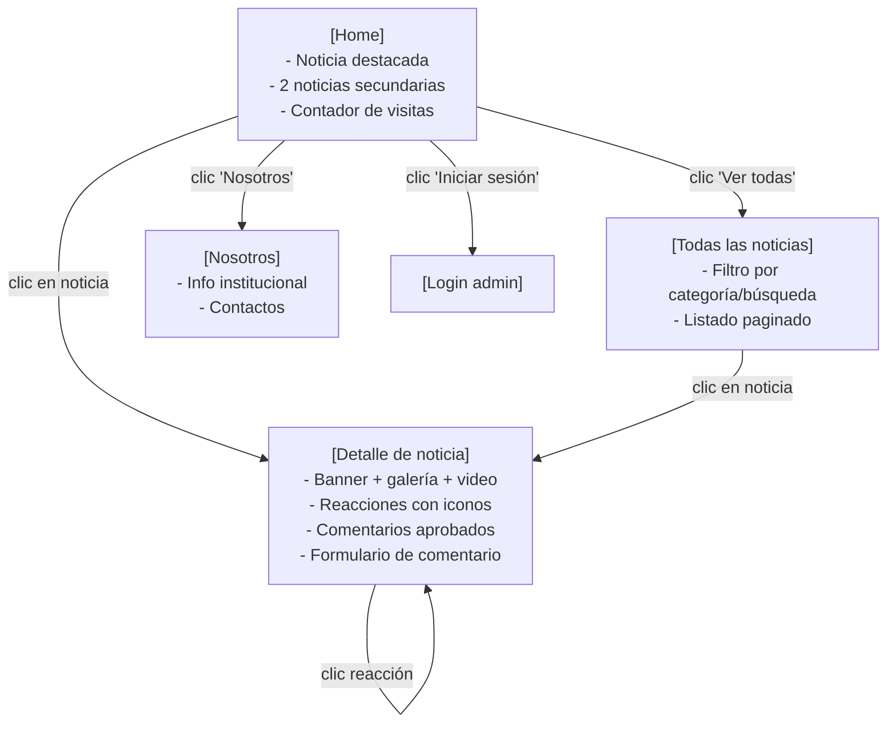
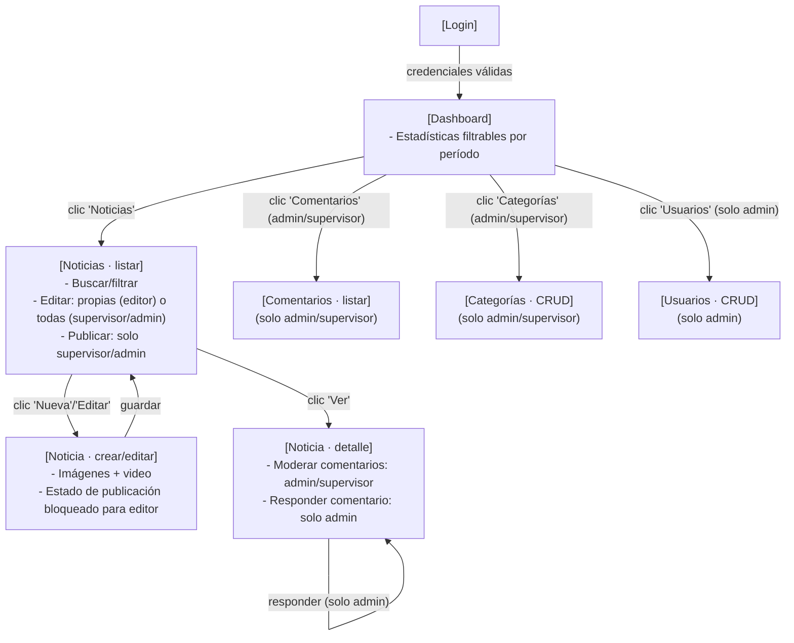

# Modelo de Dominio (UML) y Modelado de Interacción (IFML)

Este documento complementa a [Diagramas_UML.md](Diagramas_UML.md) (que modela las clases de *software*: controladores, modelos y clases de infraestructura) con dos vistas de más alto nivel:

1. Un **Modelo de Dominio UML**, centrado únicamente en las entidades de negocio y sus relaciones (sin métodos ni clases técnicas).
2. **Diagramas de Modelado de Interacción (IFML)**, que describen las pantallas (*ViewContainers*), sus contenidos y los flujos de navegación entre ellas.

> Nota de notación: Mermaid no tiene soporte nativo para la notación gráfica formal de IFML (rectángulos redondeados para ViewContainer, iconos de formulario para Form, flechas de InteractionFlow, etc.). Los diagramas siguientes son una representación equivalente simplificada usando `flowchart`, con la siguiente leyenda:
>
> | Notación IFML real | Representación aquí |
> |---|---|
> | ViewContainer (pantalla) | Rectángulo `[Nombre]` |
> | View / List (contenido) | Sub-nodo dentro del rectángulo, listado en el texto |
> | Event (clic, submit) | Etiqueta sobre la flecha |
> | InteractionFlow (navegación) | Flecha `-->` |

## 1. Modelo de Dominio (UML)

Entidades de negocio únicamente (sin `id_usuario_admin` de auditoría técnica ni columnas de control como `firma_digital`, ya detalladas en el diccionario de datos de `Informe_Arquitectura_Diseno.md`):

Reglas de negocio relevantes del dominio (no representables solo con el diagrama):
- Toda noticia requiere un mínimo de 3 imágenes.
- Un editor solo puede crear/modificar noticias donde `Noticia.usuario = Usuario` en sesión; un supervisor o admin puede hacerlo sobre cualquier noticia.
- Solo admin/supervisor pueden marcar `Noticia.publicado = true`.
- Una `Reaccion` es única por combinación de noticia + IP (de cualquier tipo).
- Un `Comentario` público nace en estado `pendiente` y requiere aprobación.

## 2. IFML — Flujo del sitio público

## 3. IFML — Flujo del panel administrativo (con permisos por rol)

## 4. Relación con los requisitos funcionales

Estos diagramas formalizan visualmente los flujos ya descritos como requisitos funcionales (RF) en `Informe_Arquitectura_Diseno.md` y el control de acceso por rol implementado en `core/BaseController.php::requireRole()`, `controllers/NewsController.php` (`isPrivileged()`/`canModify()`) y `controllers/CommentController.php` (`requireModerator()`).
